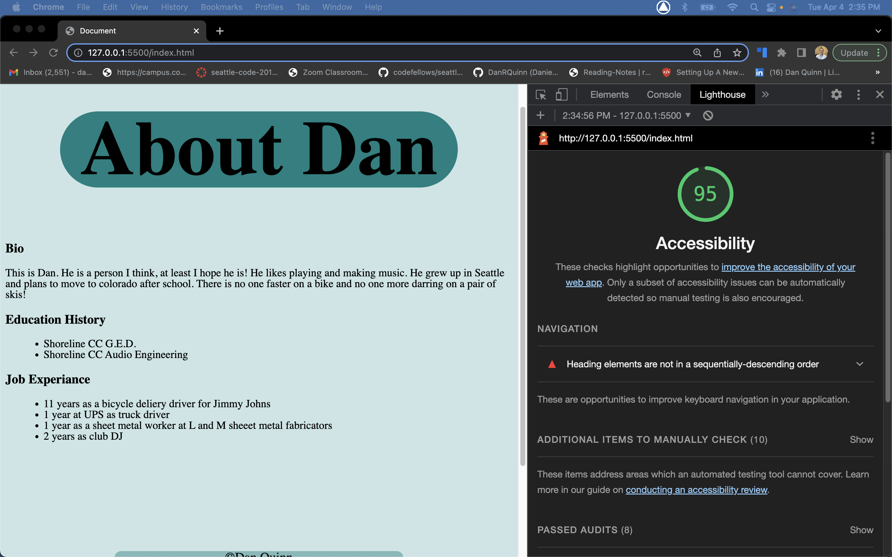

# LAB - Number 2

## About Dan

This is a about Dan website with a quiz at the beginning.

### Author: Dan Quinn

### Links and Resources

* [Class GitHub](https://github.com/codefellows/seattle-code-201d99)

### Lighthouse Accessibility Report Score

* Provide a screenshot of your score after running a Lighthouse Accessibility report.

### Reflections and Comments

* Consider including the answers to your daily journal and submission questions here
* This is also a good place to reflect on the tools and resources used and learned
